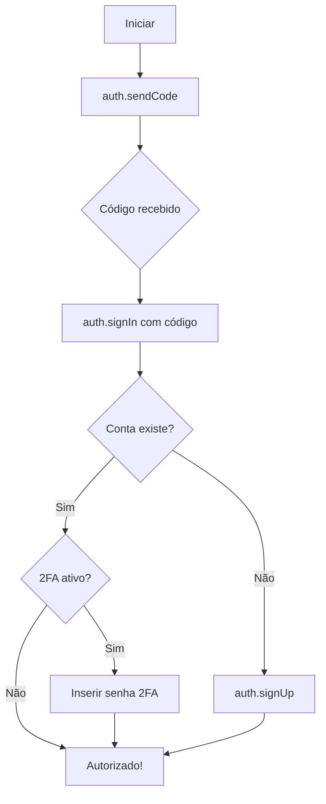

# 📘 Guia Completo da API do Telegram

> **Autor**: Compilado da documentação oficial do Telegram  
> **Última atualização**: Fevereiro 2026  
> **Objetivo**: Referência completa para criar bots e aplicativos Telegram

---

## 📑 Índice

1. [Visão Geral das APIs](#visão-geral-das-apis)
2. [Bot API - Para Bots](#bot-api---para-bots)
3. [MTProto API - Para Login com Conta](#mtproto-api---para-login-com-conta)
4. [TDLib - Biblioteca de Banco de Dados](#tdlib---biblioteca-de-banco-de-dados)
5. [Autenticação e Login](#autenticação-e-login)
6. [Métodos Disponíveis](#métodos-disponíveis)
7. [Tipos de Dados](#tipos-de-dados)
8. [Recursos Avançados](#recursos-avançados)
9. [Exemplos Práticos](#exemplos-práticos)

---

## 🌐 Visão Geral das APIs

O Telegram oferece **3 tipos de APIs** para desenvolvedores:

| API | Descrição | Uso Recomendado |
|-----|-----------|-----------------|
| **Bot API** | Interface HTTP simples para criar bots | Bots de automação, atendimento, jogos |
| **MTProto API** | API completa com acesso total | Clientes personalizados, login com conta |
| **Gateway API** | Envio de códigos de verificação | Apps que precisam enviar SMS via Telegram |

### Recursos Adicionais
- [Telegram Widgets](https://core.telegram.org/widgets) - Widgets para seu site
- [Animated Stickers & Emoji](https://core.telegram.org/stickers) - Criar stickers animados
- [Custom Themes](https://core.telegram.org/themes) - Temas personalizados

---

## 🤖 Bot API - Para Bots

### O que é?
A **Bot API** é uma interface baseada em HTTP para criar bots no Telegram. É a forma mais simples de desenvolver bots, pois o Telegram cuida de toda a criptografia e comunicação.

### Características
- ✅ Não precisa conhecer o protocolo MTProto
- ✅ Comunicação via HTTPS simples
- ✅ Bots não precisam de número de telefone
- ✅ Suporte a pagamentos
- ✅ Mais de 10 milhões de bots hospedados

### Como Criar um Bot

1. **Acesse o @BotFather** no Telegram: [t.me/botfather](https://t.me/botfather)
2. Envie o comando `/newbot`
3. Escolha um nome e username para o bot
4. Receba o **token de autenticação**

> ⚠️ **IMPORTANTE**: O token é único e dá controle total do bot. Guarde em local seguro!

### Formato do Token
```
123456:ABC-DEF1234ghIkl-zyx57W2v1u123ew11
```

---

### Fazendo Requisições

#### URL Base
```
https://api.telegram.org/bot<TOKEN>/MÉTODO
```

#### Exemplo
```
https://api.telegram.org/bot123456:ABC-DEF1234ghIkl-zyx57W2v1u123ew11/getMe
```

#### Métodos HTTP Suportados
- `GET`
- `POST`

#### Formas de Enviar Parâmetros
| Método | Quando Usar |
|--------|-------------|
| URL query string | Requisições simples |
| application/x-www-form-urlencoded | Formulários |
| application/json | Dados estruturados |
| multipart/form-data | Upload de arquivos |

#### Resposta Padrão
```json
{
    "ok": true,
    "result": { ... }
}
```

#### Resposta de Erro
```json
{
    "ok": false,
    "error_code": 400,
    "description": "Bad Request: chat not found"
}
```

---

### 📥 Recebendo Atualizações

Existem **2 formas** de receber atualizações:

#### 1. Long Polling (getUpdates)
```python
# Exemplo com Python requests
import requests

TOKEN = "seu_token"
response = requests.get(f"https://api.telegram.org/bot{TOKEN}/getUpdates")
updates = response.json()
```

**Parâmetros:**
| Parâmetro | Tipo | Descrição |
|-----------|------|-----------|
| offset | Integer | ID do primeiro update a retornar |
| limit | Integer | Máximo de updates (1-100, padrão: 100) |
| timeout | Integer | Timeout para long polling (segundos) |
| allowed_updates | Array | Tipos de update a receber |

#### 2. Webhook (setWebhook)
```python
# Configurar webhook
requests.post(f"https://api.telegram.org/bot{TOKEN}/setWebhook", 
    json={"url": "https://seusite.com/webhook"})
```

**Portas Suportadas para Webhook:**
- 443, 80, 88, 8443

**Parâmetros:**
| Parâmetro | Tipo | Descrição |
|-----------|------|-----------|
| url | String | URL HTTPS para receber updates |
| certificate | InputFile | Certificado SSL (opcional) |
| max_connections | Integer | Conexões simultâneas (1-100) |
| allowed_updates | Array | Tipos de update permitidos |
| secret_token | String | Token secreto para validação |

---

### 📤 Métodos Principais

#### getMe
Retorna informações básicas do bot.
```python
requests.get(f"https://api.telegram.org/bot{TOKEN}/getMe")
```

#### sendMessage
Envia uma mensagem de texto.
```python
requests.post(f"https://api.telegram.org/bot{TOKEN}/sendMessage", json={
    "chat_id": 123456789,
    "text": "Olá, mundo!",
    "parse_mode": "HTML"
})
```

**Parâmetros:**
| Parâmetro | Tipo | Obrigatório | Descrição |
|-----------|------|-------------|-----------|
| chat_id | Integer/String | ✅ | ID do chat ou @username |
| text | String | ✅ | Texto da mensagem |
| parse_mode | String | ❌ | "HTML" ou "Markdown" |
| reply_markup | Object | ❌ | Teclado inline ou customizado |
| disable_notification | Boolean | ❌ | Enviar silenciosamente |

#### sendPhoto
```python
# Com URL
requests.post(f"https://api.telegram.org/bot{TOKEN}/sendPhoto", json={
    "chat_id": 123456789,
    "photo": "https://exemplo.com/foto.jpg",
    "caption": "Legenda da foto"
})

# Com arquivo local
with open("foto.jpg", "rb") as f:
    requests.post(f"https://api.telegram.org/bot{TOKEN}/sendPhoto",
        data={"chat_id": 123456789},
        files={"photo": f})
```

#### sendVideo
```python
requests.post(f"https://api.telegram.org/bot{TOKEN}/sendVideo", json={
    "chat_id": 123456789,
    "video": "https://exemplo.com/video.mp4",
    "caption": "Legenda do vídeo"
})
```

#### sendDocument
```python
with open("arquivo.pdf", "rb") as f:
    requests.post(f"https://api.telegram.org/bot{TOKEN}/sendDocument",
        data={"chat_id": 123456789},
        files={"document": f})
```

#### sendAudio
```python
requests.post(f"https://api.telegram.org/bot{TOKEN}/sendAudio", json={
    "chat_id": 123456789,
    "audio": "https://exemplo.com/musica.mp3"
})
```

#### sendMediaGroup
Envia 2-10 fotos ou vídeos como álbum.
```python
import json
media = [
    {"type": "photo", "media": "https://exemplo.com/foto1.jpg"},
    {"type": "photo", "media": "https://exemplo.com/foto2.jpg"},
    {"type": "video", "media": "https://exemplo.com/video.mp4"}
]
requests.post(f"https://api.telegram.org/bot{TOKEN}/sendMediaGroup", json={
    "chat_id": 123456789,
    "media": media
})
```

---

### ⌨️ Teclados e Botões

#### InlineKeyboardMarkup (Botões Inline)
```python
keyboard = {
    "inline_keyboard": [
        [
            {"text": "Opção 1", "callback_data": "opcao1"},
            {"text": "Opção 2", "callback_data": "opcao2"}
        ],
        [
            {"text": "Abrir Link", "url": "https://telegram.org"}
        ]
    ]
}

requests.post(f"https://api.telegram.org/bot{TOKEN}/sendMessage", json={
    "chat_id": 123456789,
    "text": "Escolha uma opção:",
    "reply_markup": keyboard
})
```

#### ReplyKeyboardMarkup (Teclado Customizado)
```python
keyboard = {
    "keyboard": [
        ["Botão 1", "Botão 2"],
        ["Botão 3"]
    ],
    "resize_keyboard": True,
    "one_time_keyboard": True
}

requests.post(f"https://api.telegram.org/bot{TOKEN}/sendMessage", json={
    "chat_id": 123456789,
    "text": "Escolha uma opção:",
    "reply_markup": keyboard
})
```

#### Tipos de Botões Inline
| Tipo | Descrição |
|------|-----------|
| callback_data | Envia dados para o bot |
| url | Abre um link |
| switch_inline_query | Muda para modo inline |
| login_url | Login com Telegram |
| web_app | Abre Mini App |

---

### ✏️ Editando Mensagens

#### editMessageText
```python
requests.post(f"https://api.telegram.org/bot{TOKEN}/editMessageText", json={
    "chat_id": 123456789,
    "message_id": 100,
    "text": "Texto atualizado!"
})
```

#### editMessageCaption
```python
requests.post(f"https://api.telegram.org/bot{TOKEN}/editMessageCaption", json={
    "chat_id": 123456789,
    "message_id": 100,
    "caption": "Nova legenda!"
})
```

#### editMessageMedia
```python
requests.post(f"https://api.telegram.org/bot{TOKEN}/editMessageMedia", json={
    "chat_id": 123456789,
    "message_id": 100,
    "media": {
        "type": "photo",
        "media": "https://exemplo.com/nova_foto.jpg"
    }
})
```

#### editMessageReplyMarkup
```python
requests.post(f"https://api.telegram.org/bot{TOKEN}/editMessageReplyMarkup", json={
    "chat_id": 123456789,
    "message_id": 100,
    "reply_markup": {"inline_keyboard": [[{"text": "Novo botão", "callback_data": "novo"}]]}
})
```

#### deleteMessage
```python
requests.post(f"https://api.telegram.org/bot{TOKEN}/deleteMessage", json={
    "chat_id": 123456789,
    "message_id": 100
})
```

---

### 👥 Gerenciando Chats e Membros

#### getChat
```python
requests.get(f"https://api.telegram.org/bot{TOKEN}/getChat", 
    params={"chat_id": -100123456789})
```

#### getChatMember
```python
requests.get(f"https://api.telegram.org/bot{TOKEN}/getChatMember", params={
    "chat_id": -100123456789,
    "user_id": 123456789
})
```

#### getChatMemberCount
```python
requests.get(f"https://api.telegram.org/bot{TOKEN}/getChatMemberCount", 
    params={"chat_id": -100123456789})
```

#### banChatMember
```python
requests.post(f"https://api.telegram.org/bot{TOKEN}/banChatMember", json={
    "chat_id": -100123456789,
    "user_id": 123456789,
    "until_date": 0  # banimento permanente
})
```

#### unbanChatMember
```python
requests.post(f"https://api.telegram.org/bot{TOKEN}/unbanChatMember", json={
    "chat_id": -100123456789,
    "user_id": 123456789
})
```

#### restrictChatMember
```python
requests.post(f"https://api.telegram.org/bot{TOKEN}/restrictChatMember", json={
    "chat_id": -100123456789,
    "user_id": 123456789,
    "permissions": {
        "can_send_messages": False,
        "can_send_media_messages": False
    }
})
```

#### promoteChatMember
```python
requests.post(f"https://api.telegram.org/bot{TOKEN}/promoteChatMember", json={
    "chat_id": -100123456789,
    "user_id": 123456789,
    "can_manage_chat": True,
    "can_delete_messages": True,
    "can_restrict_members": True
})
```

---

### 💳 Pagamentos (Telegram Stars)

#### sendInvoice
```python
requests.post(f"https://api.telegram.org/bot{TOKEN}/sendInvoice", json={
    "chat_id": 123456789,
    "title": "Produto Premium",
    "description": "Acesso vitalício ao conteúdo premium",
    "payload": "premium_access",
    "provider_token": "",  # vazio para Telegram Stars
    "currency": "XTR",  # XTR = Telegram Stars
    "prices": [{"label": "Premium", "amount": 100}]
})
```

#### answerPreCheckoutQuery
```python
requests.post(f"https://api.telegram.org/bot{TOKEN}/answerPreCheckoutQuery", json={
    "pre_checkout_query_id": "query_id_aqui",
    "ok": True
})
```

#### getMyStarBalance
```python
requests.get(f"https://api.telegram.org/bot{TOKEN}/getMyStarBalance")
```

---

### 📝 Formatação de Texto

#### HTML
```python
text = """
<b>Negrito</b>
<i>Itálico</i>
<u>Sublinhado</u>
<s>Tachado</s>
<code>Código inline</code>
<pre>Bloco de código</pre>
<a href="https://telegram.org">Link</a>
<tg-spoiler>Spoiler</tg-spoiler>
<blockquote>Citação</blockquote>
"""
```

#### Markdown
```python
text = """
*Negrito*
_Itálico_
__Sublinhado__
~Tachado~
`Código inline`
```Bloco de código```
[Link](https://telegram.org)
||Spoiler||
"""
```

---

## 🔐 MTProto API - Para Login com Conta

A **MTProto API** é a API completa do Telegram, usada para criar clientes personalizados com login de conta de usuário.

### Quando Usar?
- ✅ Criar cliente personalizado do Telegram
- ✅ Acessar mensagens como usuário normal
- ✅ Funcionalidades não disponíveis na Bot API
- ✅ Automação com conta de usuário
- ✅ Acesso a grupos e canais privados

### Obtendo api_id e api_hash

1. Acesse [my.telegram.org](https://my.telegram.org)
2. Login com seu número de telefone
3. Vá em "API development tools"
4. Preencha o formulário:
   - App title: Nome do seu app
   - Short name: Nome curto
   - URL: (opcional)
   - Platform: Web/Desktop/Mobile
   - Description: Descrição
5. Copie o **api_id** e **api_hash**

> ⚠️ **ATENÇÃO**: 
> - Cada número pode ter apenas UM api_id
> - Não use para spam/flood - será banido permanentemente
> - Contas usando API não oficial ficam sob observação

---

### Bibliotecas Recomendadas

#### Python - Telethon
```bash
pip install telethon
```

```python
from telethon import TelegramClient

api_id = 12345
api_hash = "seu_api_hash"

client = TelegramClient('session_name', api_id, api_hash)

async def main():
    await client.start()
    me = await client.get_me()
    print(f"Logado como: {me.username}")
    
    # Enviar mensagem
    await client.send_message('username', 'Olá!')
    
    # Listar chats
    async for dialog in client.iter_dialogs():
        print(dialog.name, dialog.id)

client.loop.run_until_complete(main())
```

#### Python - Pyrogram
```bash
pip install pyrogram
```

```python
from pyrogram import Client

api_id = 12345
api_hash = "seu_api_hash"

app = Client("my_account", api_id=api_id, api_hash=api_hash)

async def main():
    async with app:
        me = await app.get_me()
        print(f"Logado como: {me.username}")
        
        # Enviar mensagem
        await app.send_message("username", "Olá!")

app.run(main())
```

---

### Autenticação de Usuário

#### Fluxo de Login



#### Exemplo com Telethon
```python
from telethon import TelegramClient
from telethon.errors import SessionPasswordNeededError

client = TelegramClient('session', api_id, api_hash)

async def login():
    await client.connect()
    
    if not await client.is_user_authorized():
        phone = input("Número de telefone: ")
        await client.send_code_request(phone)
        
        try:
            code = input("Código recebido: ")
            await client.sign_in(phone, code)
        except SessionPasswordNeededError:
            password = input("Senha 2FA: ")
            await client.sign_in(password=password)
    
    print("Login realizado com sucesso!")

client.loop.run_until_complete(login())
```

---

## 📚 TDLib - Biblioteca de Banco de Dados

**TDLib** (Telegram Database Library) é uma biblioteca multiplataforma para criar clientes Telegram.

### Características
- ✅ Suporte a todas as funcionalidades do Telegram
- ✅ Gerencia criptografia e armazenamento local
- ✅ Disponível para Android, iOS, Windows, macOS, Linux
- ✅ Compatível com várias linguagens de programação

### Instalação
```bash
# Clone o repositório
git clone https://github.com/tdlib/td.git
cd td

# Compile
mkdir build && cd build
cmake ..
cmake --build .
```

### Documentação Completa
[core.telegram.org/tdlib](https://core.telegram.org/tdlib)

---

## 📊 Tipos de Dados Importantes

### User
```json
{
    "id": 123456789,
    "is_bot": false,
    "first_name": "João",
    "last_name": "Silva",
    "username": "joaosilva",
    "language_code": "pt-br"
}
```

### Chat
```json
{
    "id": -100123456789,
    "type": "supergroup",
    "title": "Meu Grupo",
    "username": "meugrupo"
}
```

### Message
```json
{
    "message_id": 100,
    "from": { "id": 123456789, "first_name": "João" },
    "chat": { "id": -100123456789, "type": "supergroup" },
    "date": 1635000000,
    "text": "Olá, mundo!"
}
```

### Update
```json
{
    "update_id": 123456789,
    "message": { ... },
    "callback_query": { ... },
    "inline_query": { ... }
}
```

---

## 🚀 Recursos Avançados

### Inline Mode
Permite que usuários usem seu bot em qualquer chat digitando `@seubot query`.

```python
# Responder inline query
requests.post(f"https://api.telegram.org/bot{TOKEN}/answerInlineQuery", json={
    "inline_query_id": "query_id",
    "results": [
        {
            "type": "article",
            "id": "1",
            "title": "Resultado 1",
            "input_message_content": {
                "message_text": "Conteúdo da mensagem"
            }
        }
    ]
})
```

### Webhooks e Callbacks
```python
from flask import Flask, request

app = Flask(__name__)

@app.route('/webhook', methods=['POST'])
def webhook():
    update = request.get_json()
    
    if 'message' in update:
        handle_message(update['message'])
    elif 'callback_query' in update:
        handle_callback(update['callback_query'])
    
    return 'OK'
```

### Mini Apps (Web Apps)
```python
# Botão que abre Mini App
keyboard = {
    "inline_keyboard": [[
        {
            "text": "Abrir App",
            "web_app": {"url": "https://seusite.com/miniapp"}
        }
    ]]
}
```

### Telegram Passport
Para verificação de identidade e documentos.

### Games
Jogos HTML5 dentro do Telegram.

---

## 🔗 Links Úteis

### Documentação Oficial
| Recurso | Link |
|---------|------|
| Bot API | [core.telegram.org/bots/api](https://core.telegram.org/bots/api) |
| MTProto API | [core.telegram.org/api](https://core.telegram.org/api) |
| TDLib | [core.telegram.org/tdlib](https://core.telegram.org/tdlib) |
| Bot Features | [core.telegram.org/bots/features](https://core.telegram.org/bots/features) |
| Mini Apps | [core.telegram.org/bots/webapps](https://core.telegram.org/bots/webapps) |
| Payments | [core.telegram.org/bots/payments](https://core.telegram.org/bots/payments) |

### Ferramentas
| Ferramenta | Descrição |
|------------|-----------|
| @BotFather | Criar e gerenciar bots |
| my.telegram.org | Obter api_id e api_hash |
| Telethon | Biblioteca Python para MTProto |
| Pyrogram | Biblioteca Python alternativa |
| python-telegram-bot | Biblioteca Python para Bot API |

### Repositórios
| Projeto | Link |
|---------|------|
| Telegram Bot API | [github.com/tdlib/telegram-bot-api](https://github.com/tdlib/telegram-bot-api) |
| TDLib | [github.com/tdlib/td](https://github.com/tdlib/td) |
| Telethon | [github.com/LonamiWebs/Telethon](https://github.com/LonamiWebs/Telethon) |
| Pyrogram | [github.com/pyrogram/pyrogram](https://github.com/pyrogram/pyrogram) |

---

## 💡 Dicas Importantes

### Limites da Bot API
| Limite | Valor |
|--------|-------|
| Mensagens por segundo (mesmo chat) | 1 |
| Mensagens por segundo (diferentes chats) | 30 |
| Mensagens em grupo por minuto | 20 |
| Tamanho máximo de arquivo | 50 MB |
| Tamanho máximo com servidor local | 2000 MB |

### Boas Práticas
1. **Sempre use HTTPS** para webhooks
2. **Armazene tokens de forma segura** (variáveis de ambiente)
3. **Implemente rate limiting** para evitar flood
4. **Use offset** no getUpdates para evitar duplicatas
5. **Teste com grupos de teste** antes de produção
6. **Log todos os erros** para debug
7. **Use parse_mode** para mensagens formatadas

### Erros Comuns
| Código | Descrição | Solução |
|--------|-----------|---------|
| 400 | Bad Request | Verifique parâmetros |
| 401 | Unauthorized | Token inválido |
| 403 | Forbidden | Sem permissão |
| 404 | Not Found | Chat/usuário não existe |
| 429 | Too Many Requests | Aguarde retry_after segundos |

---

## 📝 Exemplos Completos

### Bot Echo Simples
```python
import requests
import json

TOKEN = "SEU_TOKEN_AQUI"
BASE_URL = f"https://api.telegram.org/bot{TOKEN}"

def get_updates(offset=None):
    params = {"timeout": 30}
    if offset:
        params["offset"] = offset
    response = requests.get(f"{BASE_URL}/getUpdates", params=params)
    return response.json()

def send_message(chat_id, text):
    requests.post(f"{BASE_URL}/sendMessage", json={
        "chat_id": chat_id,
        "text": text
    })

def main():
    offset = None
    while True:
        updates = get_updates(offset)
        if updates["ok"] and updates["result"]:
            for update in updates["result"]:
                offset = update["update_id"] + 1
                if "message" in update and "text" in update["message"]:
                    chat_id = update["message"]["chat"]["id"]
                    text = update["message"]["text"]
                    send_message(chat_id, f"Você disse: {text}")

if __name__ == "__main__":
    main()
```

### Bot com Teclado Inline
```python
from telegram import Update, InlineKeyboardButton, InlineKeyboardMarkup
from telegram.ext import Application, CommandHandler, CallbackQueryHandler

async def start(update: Update, context):
    keyboard = [
        [
            InlineKeyboardButton("Opção 1", callback_data="1"),
            InlineKeyboardButton("Opção 2", callback_data="2")
        ]
    ]
    reply_markup = InlineKeyboardMarkup(keyboard)
    await update.message.reply_text("Escolha:", reply_markup=reply_markup)

async def button(update: Update, context):
    query = update.callback_query
    await query.answer()
    await query.edit_message_text(f"Você escolheu: {query.data}")

app = Application.builder().token("SEU_TOKEN").build()
app.add_handler(CommandHandler("start", start))
app.add_handler(CallbackQueryHandler(button))
app.run_polling()
```

### Script Telethon para Automação
```python
from telethon import TelegramClient, events

api_id = 12345
api_hash = "seu_api_hash"

client = TelegramClient('bot_session', api_id, api_hash)

@client.on(events.NewMessage(pattern='/start'))
async def start_handler(event):
    await event.respond('Olá! Sou um bot automatizado.')

@client.on(events.NewMessage(incoming=True))
async def echo_handler(event):
    if event.is_private:
        await event.respond(f"Recebi: {event.text}")

with client:
    print("Bot rodando...")
    client.run_until_disconnected()
```

---

> 📌 **Este guia é uma referência rápida. Sempre consulte a [documentação oficial](https://core.telegram.org) para informações mais detalhadas e atualizadas.**
